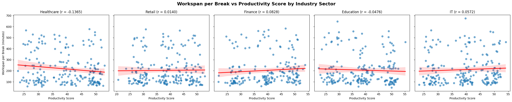
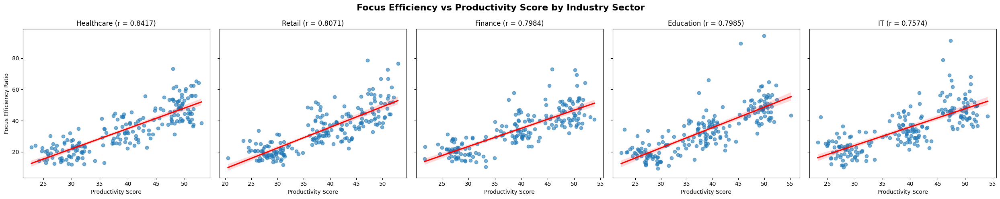
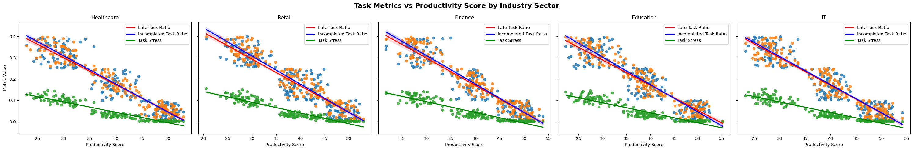
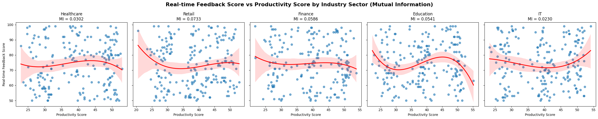
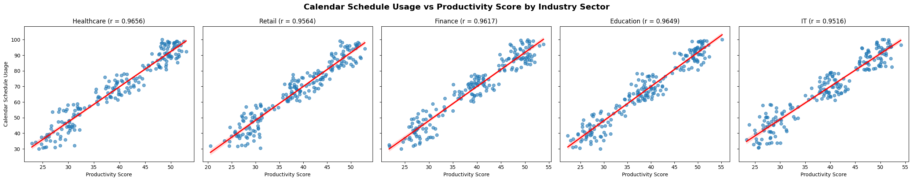
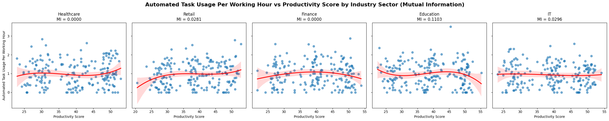
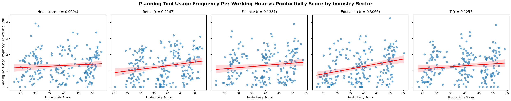
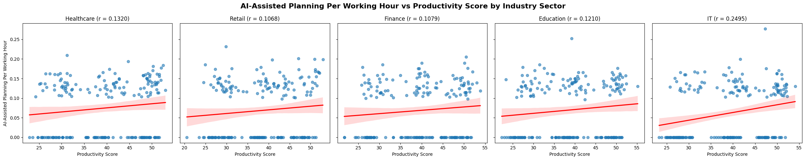
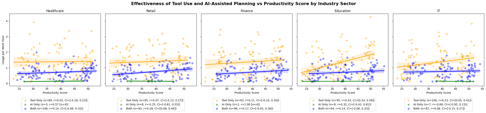

# **The Remote Work Productivity: A Multi-Industry Analysis**

## Introduction
Following the pandemic-driven shift to remote work several years ago, remote employment has become a lasting trend despite improved health conditions. Many professionals prefer this working style due to three key advantages: flexibility, cost savings, and perceived productivity gains. Remote work enables individuals to adjust their schedules according to their peak performance periods and personal lifestyles. It eliminates commuting expenses, professional wardrobe costs, and office-related expenditures. By removing travel requirements and rigid schedules, remote work reduces stress and enhances work-life balance, theoretically leading to improved productivity and job satisfaction.

However, empirical evidence challenges this assumption. Multiple studies, including Stanford research, reveal that remote work actually decreases productivity despite workers' perceptions of improved performance. Researchers attribute this decline to communication barriers, coordination difficulties, reduced creativity, and weakened self-discipline. A [survey](https://upgradedpoints.com/news/what-are-remote-workers-doing-on-the-clock/) [1] in 2023 by UpgradedPoints revealed concerning trends: remote workers frequently engage in social media browsing (74.7%), household tasks (71.6%), and online shopping (69.6%) during work hours rather than focusing on their assignments.

This project examines remote work productivity complexities through comprehensive analysis of real-world data collected from workers across five industry sectors. The objective is to identify productivity factors affecting each sector by analyzing demographic metrics, industry-specific variables, high-performance characteristics, and behavioral patterns. This approach aims to deliver actionable insights that enhance remote worker performance. The analysis combines quantitative metrics—including focus time, task completion rates, and productivity scores—with qualitative factors such as self-reported productivity levels.

This research serves dual purposes: developing analytical expertise while providing practical applications. The data analysis offers valuable experience in human resource analytics, coaching methodologies, and evidence-based decision-making processes. The findings contribute both to academic understanding of human resource management and practical guidance for organizations seeking to optimize their remote work strategies for measurable results.

## Data

The dataset, published by user ZIYA on [Kaggle](https://www.kaggle.com/datasets/ziya07/remote-worker-productivity-dataset), was designed to examine the role of Artificial Intelligence (AI) and Machine Learning (ML) in enhancing remote work productivity. 

The dataset comprises 1,000 records from workers across multiple industries, capturing comprehensive information on AI/ML adoption patterns, time management behaviors, and corresponding productivity outcomes. Each entry includes detailed metrics on workers' utilization of AI and ML tools, time allocation practices, task management approaches, and quantified productivity measures. 

## Metrics
1. **Demographic Information**
   
   * **Industry Distribution**: The sample includes workers from five key sectors: retail (203 participants), IT (203 participants), education (203 participants), healthcare (199 participants), and finance (192 participants). Participants averaged 40.5 years of age with 17.6 years of industry experience, representing a mature and experienced workforce.

   * **Work Patterns and Performance Metrics**: Workers maintained an average daily schedule of 7.5 hours (450 minutes), during which they achieved 149.7 minutes of focused work time. The typical workday included approximately 3 breaks, suggesting regular intervals for rest and recovery. Performance indicators revealed strong overall productivity, with participants completing 81.3% of their assigned tasks while maintaining a low late-submission rate of 18.2%.

   * **Technology Integration**: Technology adoption varied significantly across automation categories. Workers averaged 7 automated task executions per day, utilized productivity-assistance tools 9.4 times daily, and incorporated AI-assisted planning tools approximately 0.5 times per day. This pattern suggests selective technology adoption, with workers favoring established automation and assistance tools over emerging AI planning capabilities.
 
2. **Productivity label and Industry metric**
   
   * **Demographic and Work Hour Pattern**
      * Age shows an inverse relationship with productivity across most sectors, with younger workers demonstrating higher productivity. Finance and IT are notable exceptions to this trend.
     * Healthcare and Education are unique in showing that higher productivity workers actually log fewer daily work hours, suggesting greater efficiency rather than longer hours drive performance.
  
   * **Break Frequency Dynamics**
     * Break patterns vary significantly by industry. In Finance and IT, fewer breaks correlate with higher productivity, while Healthcare shows the opposite relationship.
     * Education presents an unusual pattern where low and high productivity workers take similar numbers of breaks (both fewer than medium productivity workers).
     * Retail demonstrates non-linear break patterns, with medium productivity workers taking fewer breaks than low performers, but high performers taking the most breaks overall.
   
   * **Core Performance Indicators**
      * Across all sectors, higher productivity consistently correlates with four key metrics: increased task completion rates, greater calendar utilization, extended focus time, and reduced late-task ratios.
   
   * **Technology Utilization**
      * Tool usage generally increases with productivity levels, with Education showing the strongest positive correlation between tool adoption and performance.
      * Healthcare presents an anomaly with an inverted tool usage pattern compared to other sectors.
      * Automated task counts and AI-assisted planning show minimal variation between productivity groups, with Healthcare and Retail being exceptions where high performers utilize more automation than low performers.
 
3. **Work and work-life balance metric**

   * **Work Span per break**
      * This metric evaluates the duration of each working session before taking a break. While longer work spans allow for sustained focus on complex tasks and deeper immersion, they can ultimately reduce overall productivity and increase errors due to mental fatigue, frustration, and burnout.
      *  From the data, the IT sector has the longest work span at 675 minutes, followed by education (648 minutes), finance (583 minutes), healthcare (578 minutes), and retail (576 minutes).
      
      * When evaluating the correlation between work span and productivity score through scatter plots with regression lines, the results show varied relationships across sectors: negative correlations in healthcare and education, and positive correlations in retail, finance, and IT.    
   
   * **Focus Efficiency**
      * This metric is calculated by dividing focus time by total working time. It evaluates workers' ability to maintain high-quality, sustained concentration on tasks by minimizing distractions and task switching, which reduces cognitive load and mental fatigue. Minimizing these behaviors eliminates attention residue and increases creativity and problem-solving abilities, leading to higher productivity.
      * The data shows that education sector workers achieve the highest focus efficiency score (94.403), followed by IT (91.413) and retail (78.629).
      
      *  When evaluating the correlation between focus efficiency and productivity scores through scatter plots with regression lines, all sectors show positive correlations, indicating that higher focus efficiency consistently leads to improved productivity.   

   * **Stress Level**
      * Task-related metrics such as late task ratio and incomplete task ratio effectively measure worker stress levels. Excessive or chronic stress impairs productivity by decreasing cognitive function, lowering motivation, and contributing to poor time management. These factors diminish work quality, strain interpersonal relationships, reduce collaboration, and lead to burnout.
      
      *  The chosen metrics are late task ratio, incomplete task ratio, and overall task stress. The late task ratio compares overdue tasks to all completed tasks, while the incomplete task ratio focuses on unfinished tasks relative to all assigned tasks. Multiplying these ratios produces an overall task stress indicator, as both factors contribute significantly to workplace stress and productivity impacts.
      * Correlation analysis between stress metrics and productivity scores shows negative relationships across all sectors and metrics, confirming that lower stress levels contribute to higher productivity.   

   * **Real-time Feedback**
      * Real-time feedback reflects workers' performance based on continuous, immediate feedback rather than periodic reviews. This approach enables employees to quickly identify and correct mistakes, increases engagement, motivates skills development, and creates a more harmonious working environment while building organizational loyalty.
      * All five industries show similar real-time feedback patterns, with scores ranging from 50 to 99 (with an average and standard deviation of 74.116 and 14.34 respectively).
      *  Linear correlation analysis shows no significant relationship between real-time feedback and productivity scores, with Pearson correlation coefficients (r) between -0.1 and 0.1 across all sectors. Spearman correlation analysis also reveals no correlation, with coefficients (ρ) ranging from -0.0311 to 0.0469.
      
      *  However, cubic regression analysis reveals an inverted U-shaped relationship that suggests an "optimal zone" where moderate feedback levels correspond to higher productivity. This optimal range varies by sector: 40-45 for healthcare, 45-50 for education and IT, and 35-40 for finance and retail. 

   * **Calendar Schedule Usage Score**
      * This metric measures how well schedules meet demand and employee preferences. High scores indicate adequate alignment between staff and workload, leading to higher employee satisfaction and better performance. Low scores suggest poor staff management—either understaffing or overstaffing—which typically increases worker dissatisfaction and absenteeism.
      * All five industries show similar calendar schedule patterns, with scores ranging from approximately 30 to 99 (with an average and standard deviation of 67.894 and 19.741 respectively).
      
      *  Linear correlation analysis shows positive relationships between calendar schedule usage scores and productivity across all sectors, indicating that better schedule management consistently improves productivity.
    
4. **Technology Adoption and Productivity**
   * **Automated Task Usage Per Working Hour**
     * This metric evaluates the effectiveness of task automation in improving productivity across industries. Task automation uses technology to complete or augment repetitive, mundane tasks quickly and efficiently, reducing human error, increasing consistency, and saving time to boost productivity.
     * The data shows that the education sector has the highest maximum usage at 3.5 tasks per working hour, while IT has the lowest maximum at 2.6 tasks per working hour. All sectors show similar average usage rates of 0.93-0.99 tasks per working hour.
      
     *  Linear correlation analysis reveals no significant relationship between automated task usage and productivity. However, cubic regression analysis using Mutual Information correlation shows varying dependencies: education has the strongest relationship (MI = 0.1103), followed by IT and retail. Healthcare and finance show complete independence between automation and productivity (MI = 0).
     *  For industries with inverted U-shaped patterns (education and IT), the "optimal zone" occurs around productivity scores of 35-45 before declining at higher levels. This suggests automation helps improve productivity to a certain threshold before potentially hindering performance due to task over-complexity, reduced flexibility, or suboptimal task matching. 
   
   * **Regular Task Planning Usage Per Working Hour**
     * This metric measures the productivity benefits of planning tools across industries. Planning tools centralize tasks, deadlines, and priorities, providing users with clear task overviews that reduce confusion, enable better prioritization, and boost productivity.
     * The data demonstrates that IT leads in maximum usage at 0.277 per working hour, followed by education (0.253), retail (0.231), healthcare (0.210), and finance (0.205). However, average usage across all industries remains similar at 0.062-0.075 per working hour.
      
     * Linear correlation analysis shows positive relationships between regular task planning usage and productivity across all industries, indicating consistent productivity benefits from planning tool adoption.  
   
   * **AI-assisted Task Planning Usage Per Working Hour**
     * This metric measures how AI-assisted task planning improves productivity across industries. AI-enhanced planning improves time management by analyzing task-related information to generate optimal schedules, prioritizing critical and time-sensitive tasks over repetitive and routine ones. This results in more effective time allocation and increased productivity.
     * From the data, usage patterns mirror those of regular planning tools: IT leads at 0.277 per working hour, followed by education (0.253), retail (0.231), healthcare (0.210), and finance (0.205). Average usage remains consistent at 0.062-0.075 per working hour across industries.
      
     *  Linear correlation analysis demonstrates positive relationships between AI-assisted task planning and productivity across all industries, confirming the productivity benefits of AI-enhanced planning.  
   
   * **Impact of AI On Task Planning and Productivity**
     * To evaluate the impact of AI-assisted planning tool on productivity, the data was divided into three groups: workers using only regular planning tools, workers using only AI-assisted planning tools, and workers using both tool types. Linear correlation analysis was performed on all groups to identify optimal task planning approaches for each industry.
      
     * Regular tools show the strongest positive correlation in education (r=0.43), while combined tools perform best in retail (r=0.28). Overall, regular tools demonstrate consistent weak to moderate positive effects across all industries. The combined approach appears most effective in retail but shows only weakly positive effects in other sectors. However, AI-only groups have extremely small sample sizes (fewer than 9 people each), making their correlation values highly unreliable despite dramatic results.
  
## Summary of Insight
1. **Age and Experience**: Younger workers generally outperform older colleagues across most sectors, with finance and IT as notable exceptions where experience provides competitive advantages. This pattern suggests that the value of cognitive agility versus accumulated expertise varies significantly based on industry-specific demands and task complexity.

2. **Work Hour and Efficiency**: Healthcare and education sectors demonstrate that productivity stems from efficiency rather than extended hours, while other industries may reward time investment. This fundamental difference reveals how value creation mechanisms vary across sectors, with some prioritizing output quality and others emphasizing sustained effort.

3. **Quality Over Quantity**: Extended work spans enable deep focus but create diminishing returns through mental fatigue and elevated stress levels. The universal positive correlation between focus efficiency and productivity, combined with the negative correlation between stress factors and performance, confirms that attention quality consistently outweighs time quantity across all sectors.

4. **Proper Feedback**: The data reveals an inverted U-shaped relationship where moderate feedback levels optimize productivity. Insufficient feedback fails to provide adequate guidance, while excessive feedback creates counterproductive pressure or distraction, highlighting the importance of calibrated communication strategies.

5. **Strategic Technology Integration**: Both regular and AI-assisted planning tools demonstrate consistent positive correlations with productivity, yet combined approaches don't necessarily outperform individual tools. This suggests that thoughtful implementation strategy matters more than tool sophistication. Additionally, the existence of optimal technology zones indicates that benefits plateau and may decline beyond certain thresholds due to increased complexity or reduced operational flexibility.

## Conclusions and Recommendations
This analysis demonstrates that productivity optimization for remote workers depends on two distinct categories of factors: industry-agnostic drivers that apply universally across all sectors, and industry-specific elements that require tailored approaches based on unique sectoral characteristics.

Two universal factors consistently drive productivity across all sectors regardless of industry context. The positive correlation between focus efficiency and productivity establishes that companies should prioritize creating conditions for undistracted, high-quality work time rather than extending working hours, as quality of attention consistently outweighs quantity of time. The universal negative correlation between stress metrics and productivity underscores stress reduction as a critical priority, since elevated stress levels impair creativity, decision-making capabilities, and long-term job satisfaction.

Optimal work patterns vary significantly across industries, with healthcare and education demonstrating that efficiency-focused approaches outperform time-intensive strategies, while finance and IT sectors show different optimization patterns that may reward sustained effort. The inverted U-shaped relationship between feedback and productivity indicates that each industry requires tailored feedback frequencies and intensities based on task complexity, decision-making stakes, and employee autonomy levels. Technology adoption also exhibits industry-specific patterns, with benefits plateauing beyond certain thresholds, suggesting that strategic tool selection aligned with sector-specific workflows outperforms comprehensive technology suites. 

Organizations should establish universal factors—focus optimization and stress management—as foundational elements, implementing performance evaluation systems that prioritize focus quality and output effectiveness over time-based metrics. Subsequently, companies must layer industry-specific adaptations, including strategic technology selection that aligns with sector workflows rather than pursuing broad digital transformation initiatives. Leadership development should emphasize industry-appropriate management skills, including optimal feedback strategies, communication styles, and support systems that align with sector-specific productivity drivers. This dual approach ensures that fundamental human factors are addressed while allowing for customization that maximizes performance outcomes in diverse remote work environments.

## References
1. Alex Miller. (April, 3, 2023). What Are Remote Workers Doing on the Clock? [2023 Survey]. retrieved from https://upgradedpoints.com/news/what-are-remote-workers-doing-on-the-clock/

2. Amin et. al. (2021). Challenges and opportunities of remotely working from home during Covid-19 pandemic, Global Transitions, Volume 3, 2021, Pages 99-108. https://doi.org/10.1016/j.glt.2021.11.001.

3. Psico-smart Editorial Team. (August 28, 2024). The Impact of RealTime Feedback on Employee Performance and Engagement. retrieved from https://blogs.psico-smart.com/blog-the-impact-of-realtime-feedback-on-employee-performance-and-engagement-165957

4. Rina D. Caballar and Cole Stryker. (September 13, 2024). What is Task Automation?. retrieved from https://www.ibm.com/think/topics/task-automation

5. Tracy Brower. (August, 6, 2023). The Productivity Problem With Remote Work. retrieved from https://www.forbes.com/sites/tracybrower/2023/08/06/the-productivity-problem-with-remote-work/
